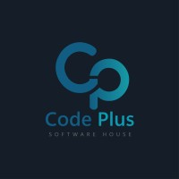

<p align="center">
  
</p>

<h1 align="center">Code Plus Software House</h1>

<p align="center">
  <strong>Flutter &amp; Dart Internship Assignments</strong>
</p>

<p align="center">
  A structured collection of hands-on Dart lessons completed during the<br/>
  Code Plus Software House internship program.
</p>

---

## About

This repository contains the internship assignment solutions for **Code Plus Software House**. Each lesson focuses on core Dart concepts that form the foundation for Flutter mobile development.

| | |
|---|---|
| **Intern** | Tarek Mohammed |
| **Company** | Code Plus Software House |
| **Track** | Flutter / Dart |
| **Language** | Dart |

---

## Lessons

| Lesson | File | Topics Covered |
|:------:|------|----------------|
| 01 | [`lesson-1.dart`](lesson-1.dart) | Variables, data types, `const` / `final`, nullable types, conditionals, string interpolation |

---

## Lesson 01 — Student Data

Demonstrates fundamental Dart syntax by modeling and printing a student profile.

**Concepts practiced**
- Primitive types: `String`, `int`, `double`, `bool`
- Compile-time constants (`const`) and runtime constants (`final`)
- Nullable types (`String?`)
- Conditional logic (`if` / `else`)
- String interpolation and console output

**Sample output**

```text
Student Information
-------------------
Id: ST2025
Name: Tarek Mohammed
Gender: Male
Age: 23
GPA: 3.1
I graduated from Capital University
-------------------
Contact Info
-------------------
Email:tarekmohammedgg@gmail.com
Phone: null
```

---

## Getting Started

### Prerequisites

- [Dart SDK](https://dart.dev/get-dart) (3.x or later)
- Optional: [Flutter SDK](https://docs.flutter.dev/get-started/install) if you plan to continue into Flutter lessons

### Run a lesson

```bash
dart run lesson-1.dart
```

---

## Project Structure

```text
codeplus-projects/
├── assets/
│   └── code-plus-logo.png
├── lesson-1.dart
└── README.md
```

---

## About Code Plus

**Code Plus Software House** is a software development company focused on building modern digital products and mentoring aspiring developers through structured internship programs.

---

<p align="center">
  <sub>Internship assignments · Code Plus Software House</sub>
</p>
